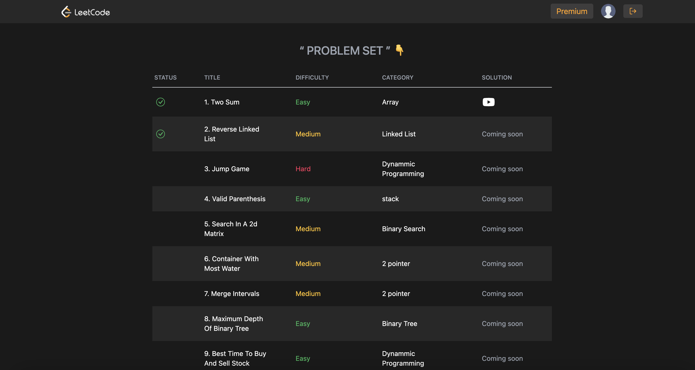

# AryaCode

AryaCode is a LeetCode-inspired platform built using modern web technologies such as React, Next.js, TypeScript, Tailwind CSS, and Firebase. Designed to replicate the core functionalities of LeetCode, AryaCode provides users with a robust platform for solving coding challenges, complete with user authentication, real-time data management, and more.

## Features

- **User Authentication**: Secure login and registration using Firebase Authentication.
- **Problem Solving**: A wide array of coding problems to practice and hone your skills.
- **Real-time Data Management**: Efficiently handles user submissions and problem-solving data using Firebase.
- **Responsive Design**: Optimized for various screen sizes using Tailwind CSS.

## Deployment

AryaCode is live and accessible here: [AryaCode Deployment](https://arya-cademy.vercel.app/)

## Screenshot

()

## Getting Started

Follow these steps to get a local copy up and running:

1. **Clone the repository:**
   ```bash
   git clone https://github.com/your-username/aryacode.git
   cd aryacode
2. **Install dependencies**
    ```bash
    npm install
3. **Run dev server**
    ```bash
    npm run dev


## Technologies Used
React: Front-end library for building user interfaces.
Next.js: React framework for server-side rendering and generating static websites.
TypeScript: Superset of JavaScript that adds static types.
Tailwind CSS: Utility-first CSS framework for styling.
Firebase: Backend-as-a-Service for authentication and real-time database.


## Contributing
Contributions are welcome! Please fork this repository and submit a pull request.

